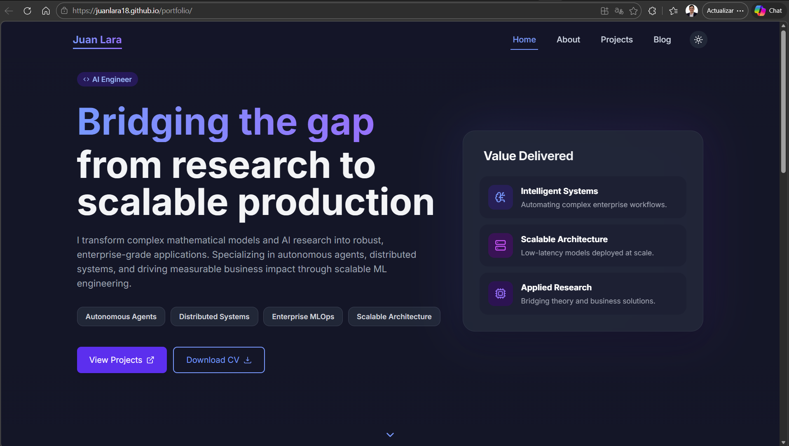

<<<<<<< HEAD
# Portfolio
Personal portfolio &amp; technical blog 
=======
<div align="center">

# Juan Lara — Portfolio & Blog

**Senior AI Engineer · Production AI · Knowledge Systems**

State-of-the-art AI, engineered for production.

[](https://juanlara18.github.io/portfolio)
[](LICENSE)
[](https://github.com/JuanLara18/portfolio/actions)

[larajuand@outlook.com](mailto:larajuand@outlook.com) · [LinkedIn](https://www.linkedin.com/in/julara/)

<br/>



</div>

---

Personal site and engineering notebook for production AI. Field notes on RAG, agents, knowledge systems, and LLM ops — alongside research deep-dives and the occasional mathematical curiosity. Features a custom Markdown blog engine with full LaTeX rendering, Mermaid diagrams, optional narrated audio in English and Spanish, dark mode, and animated UI.

## Stack

| Layer | Tech |
|---|---|
| Frontend | React 18, React Router 6 |
| Styling | Tailwind CSS, Framer Motion |
| Blog engine | react-markdown · remark-math · KaTeX · Mermaid |
| Audio | edge-tts (EN/ES voices) · Ollama + gemma4 for ES translation |
| Deploy | GitHub Actions → GitHub Pages |

## Writing

**Field Notes** — Production AI in practice
`Production RAG` · `Agentic Architectures` · `Knowledge Systems` · `LLM Ops`

**Research** — Close reads of foundational ML papers
`Attention Is All You Need` · `The Manifold Hypothesis` · `Embeddings: Geometry of Meaning`

**Curiosities** — Mathematical results that break intuition
`Collatz Conjecture` · `Gödel's Incompleteness` · `Tetris is NP-Complete` · `1+2+3+... = -1/12`

## Run locally

```bash
git clone https://github.com/JuanLara18/portfolio.git
cd portfolio/front
npm install
npm start
```

The blog manifest (`blogData.json`) is generated automatically before each build via `prebuild`.

## Adding or updating a post

1. Create or edit `front/public/blog/posts/<category>/<slug>.md` with YAML frontmatter.
2. Run the content pipeline — one command handles orphan cleanup, Mermaid validation, image optimization, EN+ES audio generation, and blog data rebuild:
   ```bash
   cd front
   npm run sync              # full pipeline
   npm run sync:fast         # skip Spanish audio (quick text iteration)
   ```
3. Commit everything and push. GitHub Actions runs `sync:check` before each deploy to catch inconsistencies early.

Requires Python 3.10+ for the audio pipeline. Ollama is optional — if not installed, Spanish audio is skipped with a warning.

## Tooling

All build-time scripts — content orchestrator (`sync.py`), blog data generation,
knowledge-base generation, image optimization, Mermaid validation, PDF export,
audio narration pipeline — are documented in [`front/scripts/README.md`](front/scripts/README.md).
For a dev-oriented walkthrough of the React app, see [`front/README.md`](front/README.md).

## Agent-facing knowledge base

The `knowledge-base/` folder at the repo root is the blog's index for AI
agents. [`KNOWLEDGE_BASE.md`](knowledge-base/KNOWLEDGE_BASE.md) is the
human-curated map (reading paths, cross-cutting views, full post catalog)
and is self-sufficient when the repo is loaded as knowledge in a Claude
Project. [`posts.json`](knowledge-base/posts.json) is a derived,
machine-queryable index (concept index, prereq graph, tech index) meant for
`jq`-style lookups inside Claude Code. Both are regenerated on every
`npm run sync` and `npm run build` — see [`CLAUDE.md`](CLAUDE.md) for how
agents consume them.

## License

MIT — see [LICENSE](LICENSE)
>>>>>>> 4835845 (Uploading the first portfolio draft: 'About Me' and 'Projects' sections.)
